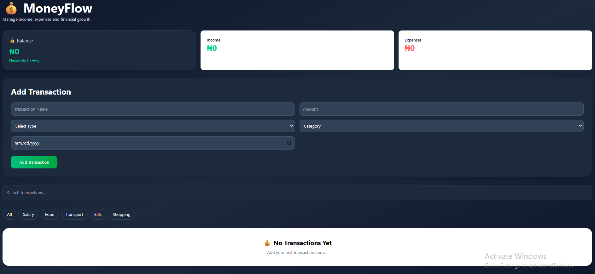
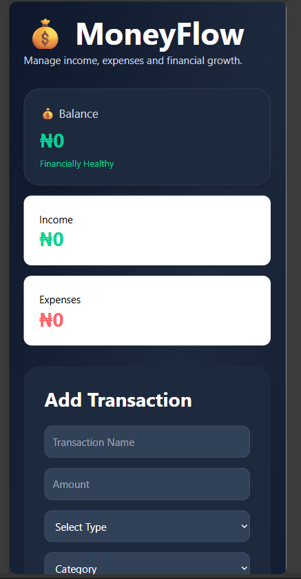

# 💰 MoneyFlow

MoneyFlow is a React-based personal finance management application that helps users track income, expenses, financial activity, and overall account balance.

This project was built as part of my journey from Plant Science into Software Development, with a focus on applying React to solve real-world personal finance problems.

## 🔗 Live Demo

[View Live Application](https://money-flow-mocha.vercel.app/)

## Features

* Add Transactions
* Edit Transactions
* Delete Transactions
* Search Transactions
* Filter Transactions by Category
* Dashboard Analytics
* Real-Time Balance Calculation
* Income Tracking
* Expense Tracking
* Local Storage Persistence
* Responsive Design

## Dashboard Analytics

The dashboard automatically calculates:

* Total Balance
* Total Income
* Total Expenses
* Financial Health Status

## Categories

Users can organize transactions into categories such as:

* Salary
* Food
* Transport
* Bills
* Shopping
* Health
* Education

## Technologies Used

* React
* JavaScript
* Tailwind CSS
* Vite
* Local Storage API

## CRUD Functionality

MoneyFlow implements complete CRUD operations:

* Create Transactions
* Read Transactions
* Update Transactions
* Delete Transactions

## Project Purpose

The purpose of this project is to demonstrate practical frontend development skills through a real-world financial management application.

Key React concepts demonstrated include:

* Component Architecture
* State Management with useState
* Side Effects with useEffect
* Props
* Conditional Rendering
* Search and Filtering
* Local Storage Persistence
* CRUD Operations

## 📸 Screenshots

### Desktop View


### Mobile View


## 🚀 Getting Started

Clone the repository:

```bash
git clone https://github.com/olajideIfe/money-flow.git
```

Navigate to the project folder:

```bash
cd money-flow
```

Install dependencies:

```bash
npm install
```

Start the development server:

```bash
npm run dev
```
## 📚 What I Learned

While building MoneyFlow, I strengthened my understanding of:

- Building reusable React components
- Managing state with `useState`
- Using `useEffect` for side effects
- Implementing CRUD operations
- Search and filtering techniques
- Persisting data with Local Storage
- Responsive UI development with Tailwind CSS
- Structuring React applications for scalability

## Future Improvements

* Monthly Spending Charts
* Budget Goals
* Recurring Transactions
* Dark/Light Theme Toggle
* Cloud Database Integration
* User Authentication

## Author

Ifedolapo Olajide

